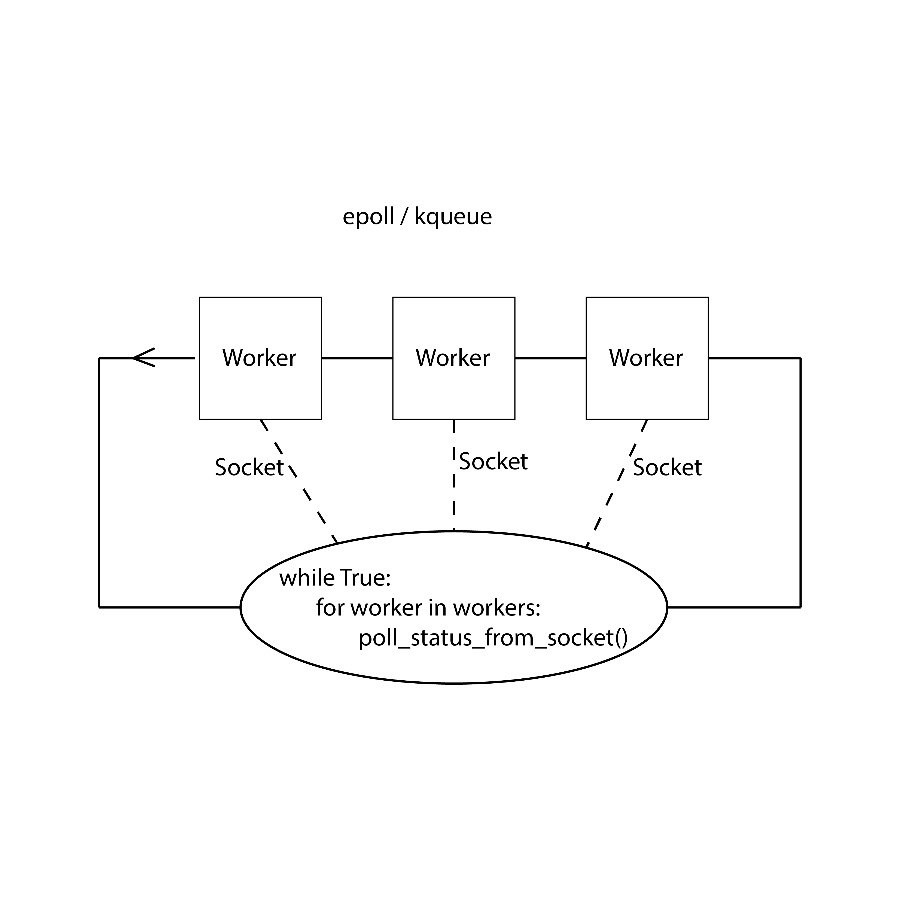

Recently I had an interesting conversation with a cool guy named Chris, where he asked if I can explain how Node.js works to some nontechnical people. I found it pretty interesting and challenging at the same time given that some of the abstractions I usually based on are probably not in audience's knowledge. After some thoughts, I found one of the ways I could do is starting from the connections in the real world and how the operating system simulates in the lower level, then moving up to Node.js.

Following the thoughts with some lookups, I eventually put up some words and scratches as bellows, explaining some common concurrent programming terminologies, e.g., event loop, promise, etc. in Unix and Node.js.

## How concurrency works in the real world

For starters, it's quite important to know that almost all of the things in the real world, are already happening concurrently.

Taking a simple real-world example: every morning, I open my phone, order one cup of coffee and one sandwich before going to pick up, they both need about 4 mins to prepare. After 5 minutes, I get a message from the coffee shop: the manager texted me confirming the sandwich and coffee are all done by two different cooks already, I can pick up anytime I want. Time saved.

That's how easy concurrency happens in real life; it should be easy for any nontechnical person to understand. And to make it even simpler, we can abstract the participant groups by different responsibilities, scheduler, and worker.

## The concept of scheduler and workers

It's simple for concurrency to happen because, for the most part, it's been done by just one scheduler, who schedule and keep an eye for the tasks, and some workers who do the job. You might argue that the scheduler could be unnecessary since the worker can directly reach back, but thing could happen, and there has to be someone continually checking the earlier task he delegated so that the tasks could be guaranteed to be reported back. In my case, the cook might get sick or anything making him unresponsive and never reach back. There has to be someone, at the very least, poke me back if one order never gets done for a long time. Which leads to another concept of "timeout" but I won't go further on that.

## The implementations from an operating system (Unix)

So how did the operating system implement the scheduler and worker concept into our system? And before we move to the mechanism of asynchronous tasks in the system level, let me provide some basic explanation of the related techniques/terms that work in a Unix like system. By the way, most of the low-level implementations are very close to the real world.

### Servers as workers

A server is where we do our tasks; it's like the kitchen for our cooks working on the sandwich and coffee. A Unix server can handle tasks like file system read/write, DNS lookup, HTTP Get/Response.

### Socket to communicate

A socket is like a phone connection when it's connected between one cook in the kitchen and the manager from the front desk. The manager and the cook can talk with each other in either way. For this case, most of the case would be our scheduler checking every socket to see if anything has been done, the worker will then answer with the status at that moment. You can picture the scene that a manager keep asking workers, "Hey, have you done with the coffee?", "Not yet," "Hey, have you done with the sandwich?", "Not yet" over and over.

### Looping and Polling to check workers' status

As mentioned earlier, the manager will constantly be calling into the workers through a socket and see if anything has been done yet. This technique could be done in some different ways in a different operating system, e.g. epoll, kqueue, but the ultimate purposes are similar: keep looping and polling through all socket connections and let them check in with the current status.

## Concurrency in Node.js

Concurrency in Node.js is another abstraction based on synchronous programming while utilizing epoll/kqueue for asynchronous tasks.

## Further explanation for some abstract terms

### Event loop

It's an abstraction wraps over epoll/kqueue, for semi-endlessly looping and pooling all events/sockets registered in the event queue. Whenever an event or a socket start giving "finished" sign, the event got polled by event loop and pushed to the following step with callback handler, which will either executed by V8 or pushed into Event Queue again for further concurrent follow up tasks.

### Callback event

One callback is an event handler attached with one specific event; this event is attached with the function that holds the callback. Whenever a worker finished a job, the worker let the event loop know by socket, the callback event then got triggered, and the callback with results from the job got pushed into Javascript call stack.

### Promise

It's a type of syntax sugar that wrap over callback function; a callback function tells what the following working needs to be done after finished. Promise makes those after-finished work chain-able and compose-able.

### Async await

A syntax sugar wrap over Promises makes those functional/compose-able Promises working in procedural one stop at a Promise.