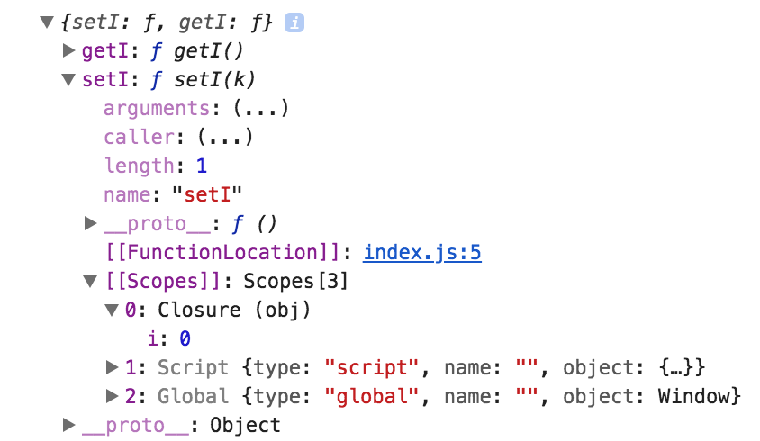

Chrome is amazing, it provides closure scope variable for a better debugging experience.

With the following codes in the console, the obj function returns an object with a closure. Without the developer tool, we don't know what exactly the closure is for either `setI or getI`, but after logging the returning object, Chrome gives us a `[[Scopes]]` referencing object for both `setI` and `getI`, with the Closure obj of `i`.

```
let obj = function() {
  let i = 0

  return {
    setI(k) {
      i = k
    },

    getI() {
      return i
    },
  }
}

let x = obj()

console.log(x)
```

