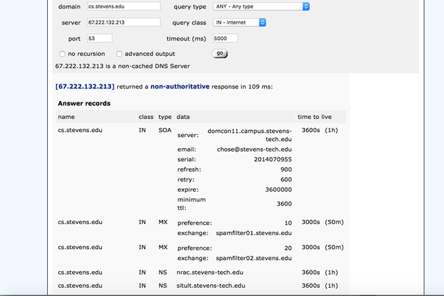

## 1. Header 

# Header 1

## Header 2

### Header 3

#### Header 4

##### Header 5

###### Header 6

### 1-1. Header Alignment 

##### Left(Default)

## 2. Body Text

Lorem ipsum dolor sit amet, [test link](#) adipiscing elit. **This is strong.** Nullam dignissim convallis est. Quisque aliquam. *This is emphasized.* Donec faucibus. Nunc iaculis suscipit dui. 5<sup>3</sup> = 125. Water is H<sub>2</sub>O. Nam sit amet sem. Aliquam libero nisi, imperdiet at, tincidunt nec, gravida vehicula, nisl. <u>Underline</u>. Maecenas ornare tortor. Donec sed tellus eget `COPY filename` sapien fringilla nonummy. Mauris a ante. Suspendisse quam sem, consequat at, <del>Dinner’s at 5:00.</del> commodo vitae, feugiat in, nunc. Morbi imperdiet augue <mark>mark element</mark> quis tellus.

## Image


## 4. Blockquotes

> Lorem ipsum dolor sit amet, test link adipiscing elit. Nullam dignissim convallis est. Quisque aliquam.

## 5. List Types

### Unordered List

* Lorem ipsum dolor sit amet, consectetur adipiscing elit.
* Nam ultrices nunc in nisi pellentesque ultricies. Cras scelerisque ipsum in ante laoreet viverra. Pellentesque eget quam et augue molestie tincidunt ac ut ex. Sed quis velit vulputate, rutrum nisl sit amet, molestie neque. Vivamus sed augue at turpis suscipit fringilla.
* Integer pretium nisl vitae justo aliquam, at varius nisi blandit.
  1. Nunc vehicula nulla ac odio gravida vestibulum sed nec mauris.
  2. Duis at diam eget arcu dapibus consequat.
* Etiam vel elit in purus iaculis pretium.

### Ordered List

1. Quisque ullamcorper leo non ex pretium, in fermentum libero imperdiet.
2. Donec eu nulla euismod, rhoncus ipsum nec, faucibus elit.
3. Nam blandit purus gravida, accumsan sem in, lacinia orci.
  * Duis congue dui nec nisi posuere, at luctus velit semper.
  * Suspendisse in lorem id lacus elementum pretium nec vel nibh.
4. Aliquam eget ipsum laoreet, maximus risus vitae, iaculis leo.

### Definition Lists

kramdown
: A Markdown-superset converter

Maruku
: Another Markdown-superset converter

## 6. Tables

| Header1 | Header2 | Header3 |
|:--------|:-------:|--------:|
| cell1   | cell2   | cell3   |
| cell4   | cell5   | cell6   |
|----
| cell1   | cell2   | cell3   |
| cell4   | cell5   | cell6   |
|=====
| Foot1   | Foot2   | Foot3


## 7. Code Snippets

### Highlighted Code Blocks

```css
#container {
  float: left;
  margin: 0 -240px 0 0;
  width: 100%;
}
```

### Standard code block

    <div id="awesome">
      <p>This is great isn't it?</p>
    </div>
